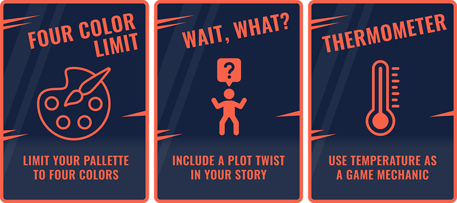
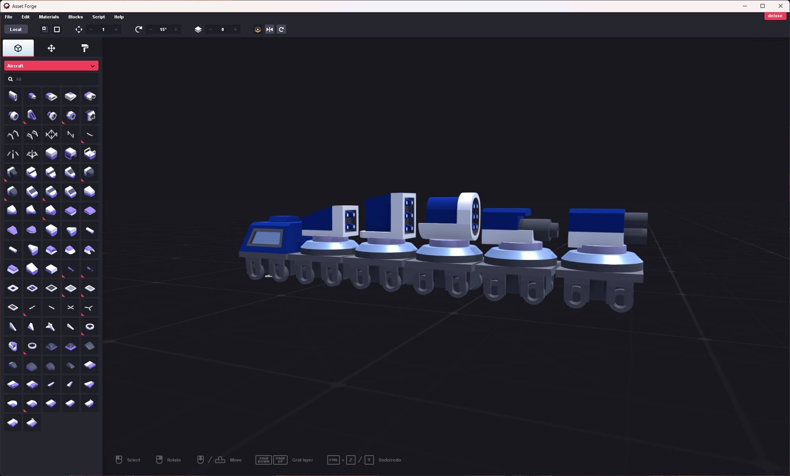
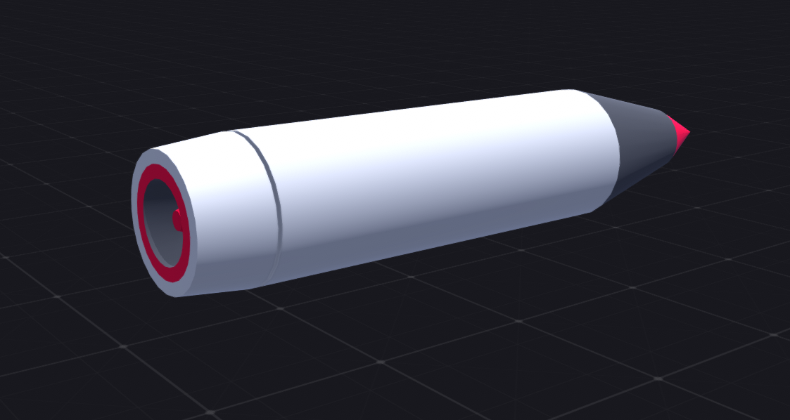
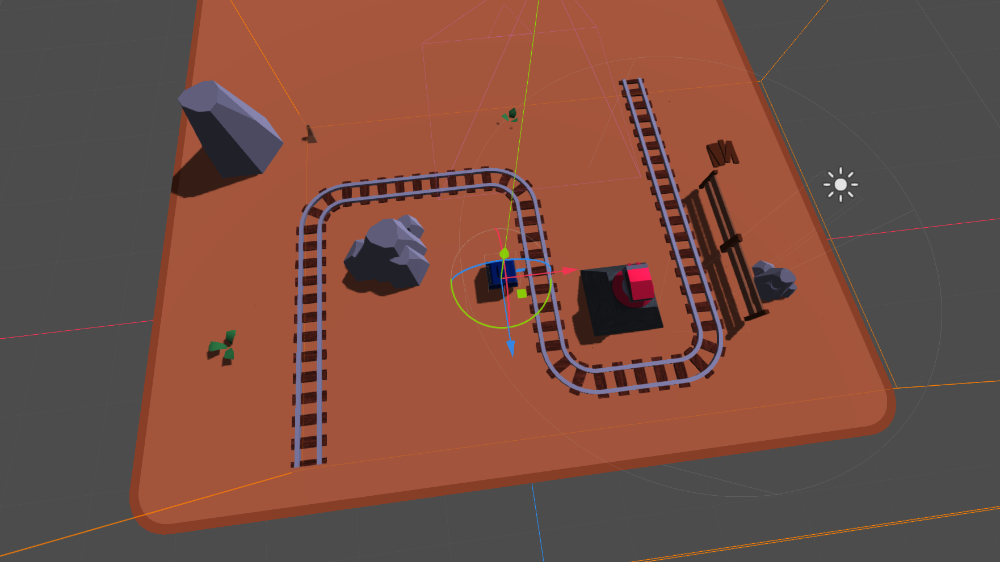
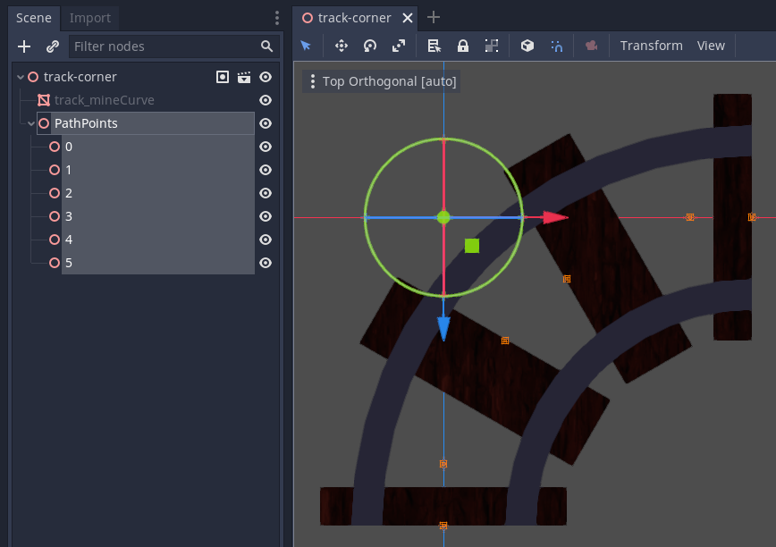

+++
title = "Devlog: Godot Wild Jam #53"
slug = "devlog-godot-wild-jam-53"
summary = "A wild jam in Godot."
date = "2023-01-23"
tags = ["devlog", "game-jam"]
image = "./header.jpg"
+++

[Godot Wild Jam](https://godotwildjam.com/) is a monthly game jam centred around building games in the [Godot game engine](https://godotengine.org/). It starts on the second Friday of each month and lasts for nine days.

Godot has been gaining a lot of traction in recent years. It's considerably newer than Unity and Unreal (its first release appeared back in 2014) and while it's not as popular for large, complex projects, [that's something the authors are actively working to improve](https://godotengine.org/article/whats-missing-in-godot-for-aaa/). Version 4 is in beta at the time of writing and the first stable release of it seems imminent.

Previously, I had only done a handful of experimental projects in Godot. A jam seemed like a good way to dive right into it and build something more substantial, so I signed up for GWJ #53 (Jan 13 - Jan 22).

Like most jams, each GWJ follows a theme—a keyword or phrase (chosen by the organisers before the jam begins) that participants must adhere to in some way. Each one also has three optional wildcards to make things a little more interesting.

For the GWJ #53, the theme was **Assembly Required**, and though I decided not to use any, the wildcards were:

I had a few ideas in mind for my game and ultimately went with this:

> Train Blazer: a top-down vertical scrolling game where you must place tracks in front of a moving train to navigate it through a series of enemy defences. As you go, upgrade your train with more weapons to improve your chances of survival.

### The first scene

The first thing I wanted to do was get a feel for visuals. I opted to make the game in 3D (which in hindsight was probably not the best idea as the extra dimension made development more complicated than it was worth), and while I have some basic Blender skills, they weren't up to the task of creating all the models I'd need in a reasonable amount of time. Instead, I used [Asset Forge Deluxe](https://assetforge.io/) to quickly piece together the terrain, scenery, track, train cars, and enemy structures.

Train and projectile models made in Asset Forge

With most of the models exported, I mocked up the first scene in Godot to get an idea of how the first level might look. Using [GridMaps](https://docs.godotengine.org/en/stable/tutorials/3d/using_gridmaps.html), I laid out some terrain, scenery, track, and an enemy turret:

GridMaps definitely made that process quick and easy, but I realised soon after that they're quite limited in what they can do. They're designed for placing mesh instances rather than full nodes, so there's a limit to how much information you can embed in each cell of the grid. That, and not everything in this game is supposed to be confined to a grid, so I was only able to use GridMaps for the terrain and scenery.

For everything else, I eventually had to implement my own grid logic, which was pretty easy to do because of the fact all of the models had consistent scaling (so they each fit within the cell size of the GridMaps)—it was mostly a matter of using whole integer values for translations.

### Dynamic tracks

The next thing I tackled was dynamic track placement. Since the player has to be able to place new track segments during gameplay, the game can't predetermine the path of the track. My initial attempt to solve that was direct and lazy; I had two scenes, one for each type of track (straight and curved), and added a [Path](https://docs.godotengine.org/en/stable/classes/class_path.html) (with enclosed [PathFollow](https://docs.godotengine.org/en/stable/classes/class_pathfollow.html#class-pathfollow)) to each. The idea was to place a train car in the PathFollow node, move it along the segment at a given speed, then pass it to the next segment and repeat the process until the train car reaches the end. This came with some obvious drawbacks:

* Baking the path into each track piece meant it wouldn't necessarily go in the correct direction, which was awkward to account for in scripting.
* Seamless transitions between segments would be difficult.

I went back to the drawing board and decided to write a system that would instead generate a path at runtime. To do this, I replaced the paths in the track segment scenes with [Spatial](https://docs.godotengine.org/en/stable/classes/class_spatial.html) nodes representing the points to construct a path with:

The game needs to start with some existing track (otherwise the player would lose instantly), so the system works by traversing track nodes already placed inside a node labelled `Track`. Player-spawned track segments are added to the same node and the system extends the path (or more specifically, the path's [Curve3D](https://docs.godotengine.org/en/stable/classes/class_curve3d.html)) accordingly:


# update_curve updates the given curve to match the current state of track segments
func update_curve(curve):
    var new_curve = curve
    var segments = track.get_children()

    # Assume track segments are ordered from closest to furthest
    for i in range(curve_last_extended_to_segment + 1, segments.size(), 1):
        # Path points within a segment should also be in distance order
        var points = segments[i].get_node("PathPoints").get_children()
        curve_last_extended_to_segment = i

        # Determine which way to traverse the points - from last to first if the last point is closer, otherwise first to last
        if points[-1].global_translation.distance_to(path_end) < points[0].global_translation.distance_to(path_end):
            for j in range(points.size(), 0, -1):
                path_end = points[j - 1].global_translation
                new_curve.add_point(path_end)
        else:
            for j in points.size():
                path_end = points[j].global_translation
                new_curve.add_point(path_end)

    return new_curve


TODO:
* Train car spawning logic and supporting multiple train cars on the track
* Enemy turret logic and refactoring the script to handle turrets generically
* Integration of shaders for the missile jet, explosion, and spawning visual effects
* Track placement validation and updating the grid system to keep track of blocked cells
* Audio work
* HUD work and integration with game input/state
* Menus