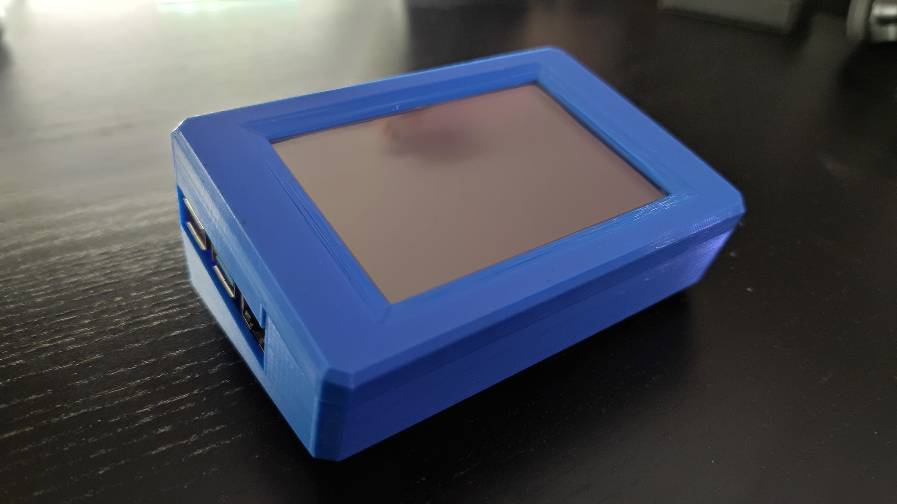
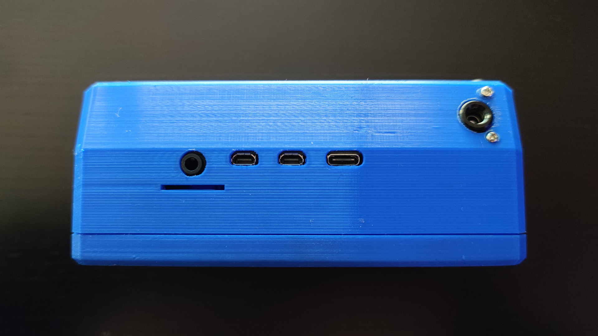
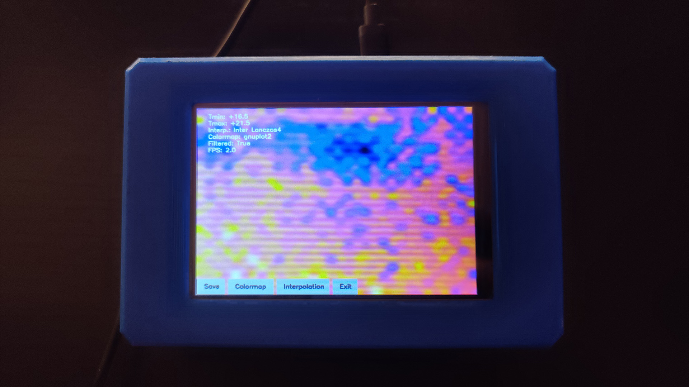
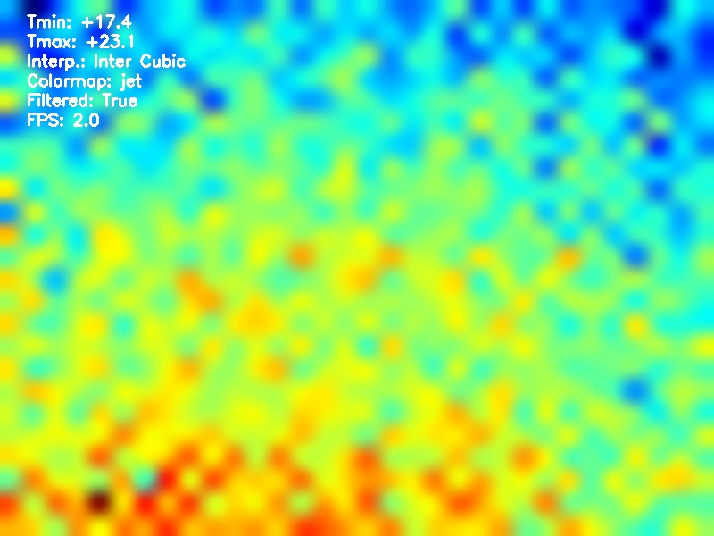

+++
title = "Raspberry Pi Thermal Camera Viewer"
slug = "pi-thermal-camera-viewer"
summary = "A Python solution for viewing MLX90640 thermal camera output on a Pi."
date = "2022-11-20"
tags = ["python", "opencv", "pi", "brief"]
image = "/images/post-headers/pixellated-code.png"
+++

My dad recently built a handheld thermal imaging camera consisting of a Raspberry Pi, touchscreen display, Adafruit MLX90640 far-infrared camera, and 3D-printed case:

Front - touchscreen

Top - IR camera mounted in the top right

On the software side, he started with https://github.com/tomshaffner/PiThermalCam, a Python package providing viewing capabilities on Pis with the MLX90640. It provides two modes of operation:

* On-screen mode, which displays the camera feed in a window with keyboard controls.
* Server mode, which runs a local Flask web server for viewing and controlling the camera feed via a browser.

It's a great project, which you can read more about in much more detail in a post written by the author [here](https://tomshaffner.github.io/PiThermalCam/).

The problem was that my dad wanted to be able to control the feed without any connected peripherals by using the touchscreen instead, which is not supported by PiThermalCam. After investigating, I decided to write an alternative solution in Python; it's based very much on PiThermalCam for the parts concerning the camera connection and image processing, but I ended up refactoring most of it to make it a little easier for me to understand and maintain. I also took the opportunity to rework the text output to make it more legible on this particular display.

For on-screen controls, an obvious option was to use Qt since OpenCV has some high-level GUI functions that leverage Qt, including buttons—but I didn't like the idea of installing such a heavy library and recompiling OpenCV just for the sake of drawing some buttons. Instead, I wrote a crude solution for drawing buttons straight into the output image using OpenCV's rectangle and text drawing functions. The end result (pictured below) isn't pretty, but definitely functional!

Display with camera feed

Snapshot saved on the device

You might notice from the image above that the frame rate isn't great—it averages around 2fps and occasionally drops a frame. Not that it matters much for the purposes of thermal imaging, but even so, there's definitely some wiggle room considering the MLX90640 is supposed to support frame rates up to 16 Hz.

On that basis, I'm thinking of rewriting the software in C++ to see if I can squeeze a bit more performance out of the Pi. I'll be sure to post a follow-up if I get anywhere with that.

Until next time, thanks for reading!

---

*If you'd like to see the code for this project, you can find it at https://github.com/Riari/pi-thermal-cam*