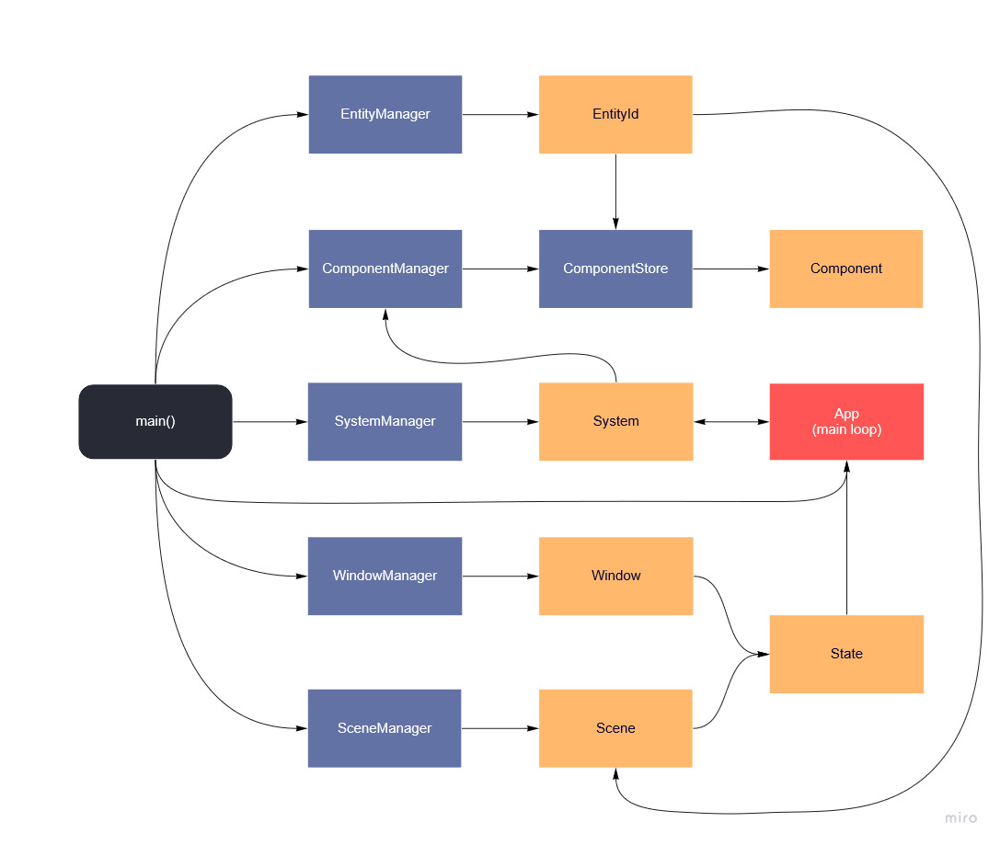
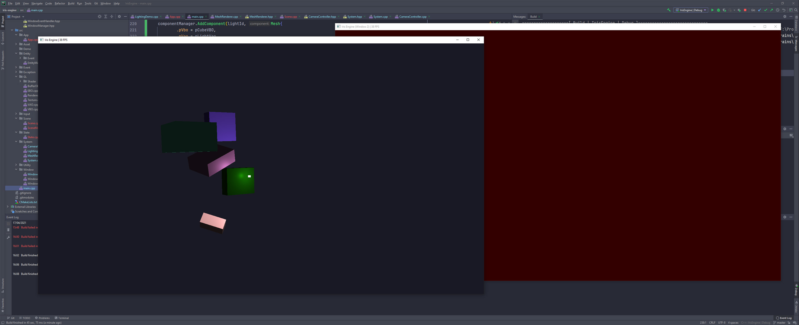

<!-- +++
title = "3D Game Engine Devlog, Part 2: Scene Improvements"
slug = "3d-game-engine-devlog-part-2-scene-improvements"
aliases = [
    "/posts/2021/04/building-a-3d-game-engine-part-2-scene-improvements/"
]
description = "Improvements to build time and scene integration."
date = "2021-04-18"
tags = ["devlog", "cpp", "game-engine", "ecs"]
image = "/images/post-headers/building-game-engine-generic.png"
+++ -->

Before I get into the main topic for this post, I want to briefly cover build time for the project. Up until now, on my desktop machine (AMD Ryzen 7 1700X) a full build would take approximately 1 minute 15 seconds, and an incremental one (small changes in first party sources) would take around 40 seconds. Not terrible, but it could get annoying during quick iterations of a feature or change.

I wasn't sure there was much I could do to greatly improve it, and this is an area I'm not very familiar with, but I had a few ideas. The first was to remove unused includes—for this, I used CLion's built-in code inspection to aid in identifying and removing unused imports. I did that before realising that there's an "Optimize imports" feature that pretty much takes care of this automatically, but it wasn't a big deal since the project is still very small and there weren't many unused imports to deal with. This had no discernable impact, but it was worth a shot.

The second step was to introduce a precompiled header (PCH). This provides a means of caching an intermediate header compilation phase, speeding up subsequent builds where the header hasn't changed. Setting it up is a matter of specifying includes that you want to precompile—common candidates for this are STL and third party headers that you're importing numerous times throughout your project, but you can also include first party headers if they're infrequently changed. From this list, an intermediate `.pch` file is produced and included by the compiler.

There are a few ways of going about that, but in my case, I used CMake's [target_precompile_headers](https://cmake.org/cmake/help/latest/command/target_precompile_headers.html):

```
target_precompile_headers(
        ${PROJECT_NAME} PRIVATE

        # STL
        <algorithm>
        <utility>
        <memory>

        # Third-party
        <spdlog/spdlog.h>
        <fmt/core.h>
        <glad/glad.h>
        <GLFW/glfw3.h>
)
```

The impact it had on build time was negligible, but at least the PCH is in place. Whether or not it's worth keeping is debatable as it can be problematic if not properly maintained, but I'll leave it in for now.

The third step was to swap out the build system I was using—Make—with [Ninja](https://ninja-build.org/), a popular alternative. It's advertised as being speed-focused and did actually improve my build time a little. It's now down to ~55 seconds for a full build and ~32 seconds for an incremental one.

I'm sure I could dig further into this to speed things up a little more, but I don't think it's worth worrying about at this point. So, on to the main topic: scenes!

---

### Scenes

As I mentioned in the previous post, I had a very rudimentary setup for defining scenes. I had an abstract `Scene` class, of which a concrete implementation could be written per distinct scene in a game:

```cpp
class Scene
{
public:
    virtual void Setup(float aspectRatio) = 0;
    virtual void Update(Window&) = 0;
    virtual void Render(Window&) = 0;
    virtual void Teardown() = 0;
};
```

For demo/testing purposes, I had a single scene implementation called `MainScene`, where the `Setup` method carried out a ton of work; it handled registering component types, instantiating and configuring entities, instantiating and registering systems, and priming system/component dependencies—such as shader programs. This worked, but it culminated in way too much responsibility and a total lack of efficiency between scenes. It was also nowhere near the data-driven design I really want.

The first step I took to remedy that was to move the `MainScene::Setup()` logic into `main()` (a big step backwards in some ways, but it'll have to do until I work on appropriate formats for storing entity component data on disk). This immediately presented an issue: where `MainScene` had members for each system it used so it could explicitly call their Update/Render methods, I no longer had a logical place to do that. This called for the introduction of two more layers to the engine: *State* and *App*.

**State** simply holds references to a Window and a Scene (i.e. which Window to render which Scene to).

**App** is the new home for the main loop, removing that responsibility from individual Window instances. It takes in a list of States and provides an interface for Systems to register themselves to be updated at various points during the main loop.

I also wrote a `SceneManager` to make creating and keeping track of scenes a little easier. Aside from those new additions and moving entity creation back into `main()`, the biggest changes occurred in `Window`, where I introduced some methods to aid the main loop (keeping Window-specific state such as timers on each Window instance), and `Scene`, which now carries two simple properties: a clear colour (for `glClearColor`) and a set of entity IDs.

The new `Window` and `Scene` headers now look like this:

**Window.hpp**
```cpp
class Window
{
public:
    Window(int id, const char *title, GLFWmonitor* monitor, int width, int height, double fpsCap, GLFWwindow* share = NULL);
    ~Window();

    [[nodiscard]] int GetID() const;

    GLFWwindow* GetGLFWWindow();
    int* GetSize();
    int* GetFramebufferSize();
    float GetAspectRatio();

    void MakeCurrent();
    void EnableVsync();
    void SwapBuffers();

    void SetInputMode(int mode, int value);
    void SetTitle(const char* title);
    const char *GetTitle();
    void SetShouldClose(bool);

    bool ShouldClose();

    void Tick();
    [[nodiscard]] bool ShouldUpdateFPS() const;
    [[nodiscard]] bool ShouldUpdate() const;
    void OnUpdated();

    [[nodiscard]] double GetDeltaTime() const;
    [[nodiscard]] double GetLastLoopTime() const;
    [[nodiscard]] int GetFrameCount() const;
    void ResetFPSState();

    void DispatchFrameBufferEvent(int w, int h) const;
    void DispatchMouseButtonEvent(int button, int action, int mods) const;
    void DispatchCursorPosEvent(double x, double y) const;
    void DispatchScrollEvent(double x, double y) const;
    void DispatchKeyEvent(int key, int scancode, int action, int mods) const;

private:
    const int m_id;
    const char *m_title;
    GLFWwindow *m_window;
    std::shared_ptr<spdlog::logger> m_logger;

    double m_updateFrequency;
    double m_frameFrequency;
    double m_deltaTime = 0;
    double m_updateTime = 0;
    double m_lastFrameTime = 0;
    double m_lastLoopTime = 0;
    double m_fpsTime = 0;
    int m_frameCount = 0;

    static Window* GetPointer(GLFWwindow *window);
};
```

**Scene.hpp**
```cpp
class Scene
{
public:
    explicit Scene(int id);

    void SetClearColor(glm::vec4);
    glm::vec4 GetClearColor();

    void AddEntity(EntityId);
    std::set<EntityId> GetEntities();
    void RemoveEntity(EntityId);

private:
    int m_id;
    glm::vec4 m_clearColor;
    std::set<EntityId> m_entityIds;
};
```

With all of those changes in place, the program flow now looks like this:

1. Initialise runtime options, logging, and GLFW
2. Create the main window and initialise GLAD
3. Register input bindings
4. Register component types and systems
5. Register systems to App instance
6. Initialise GL resources—VAO, VBO, shader programs, etc
7. Create the main scene
8. Generate entities for the main scene and set up the camera
9. Create a State for the main window and main scene
10. Run App (start the main loop)
    - Poll events
    - Iterate over states
        - Switch to the window's context
        - Update registered systems with state: `Update` -> `PreRender` -> `Render` -> `PostRender`

Here's a rough overview of how the ECS, Window, Scene, and App fit together (some elements outside the scope of this post, such as InputManager and AssetManager, are not pictured):


Lastly, here's a screenshot of it in action with two windows and scenes:



It works well—the only issue visible above is the lack of any entities being drawn in the second scene/window. I think this is because I re-used the entities from the main scene and there are some OS/driver level limitations in terms of what GPU resources can be shared between windows. To fix that, I tried sharing the main window context's objects with the second window context via GLFW's built-in support for [context object sharing](https://www.glfw.org/docs/3.3/context_guide.html#context_sharing), but that unfortunately made no difference. It probably comes down to the fact that certain GL resources can't be shared and need to be created for each context, but I'm not too concerned about it because having multiple windows is an extremely rare requirement for a game—the main thing is this is a step closer to having data-driven scenes that I can easily switch between for a given render target.

There is one other caveat with the new approach in that System updates now have to take in a set of Entity IDs for the Scene being updated and determine the intersection of that set and the System's internal list, but that's not a major issue and at least it's working for now.

---

At this point, I have more options than ever as to what I should tackle next; resuming work on the rendering system, building out the asset pipeline, improving ECS/Scene efficiency, and beginning work on multithreading support are just a few examples. I think I'll focus on rendering next—not least because I still have *a lot* to learn about OpenGL!

I'm also discovering that building the engine without a specific game concept (or at least genre) in mind is not the best idea, both in terms of motivation and planning. The requirements of an engine are largely driven by the first game to implement it, so I should probably start thinking about what kind of game I should build with this one to prove its features, but that's a topic for a future post.

---

*The latest code for this project can be found at [https://github.com/Riari/iris-engine](https://github.com/Riari/iris-engine).*