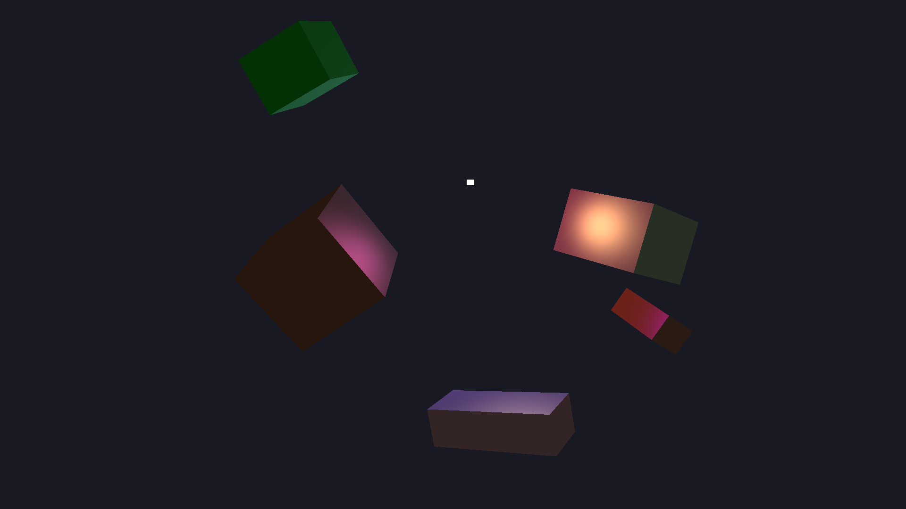
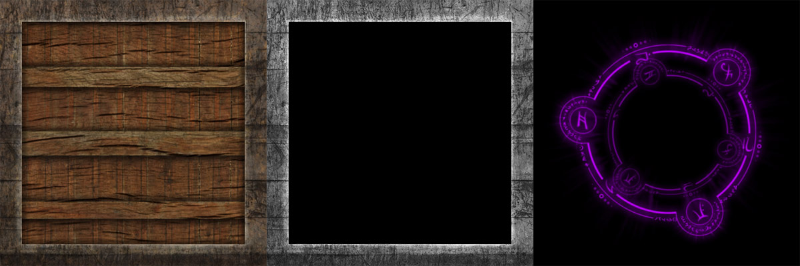

At this point, for the most part, I'm back to following [LearnOpenGL](https://learnopengl.com/)—and I'm not going to reiterate in detail any of the topics already covered there. If you want to know more about the topics mentioned in this post, I encourage you to read through the corresponding material on that site!

Since the last post, the first thing I did was a small tweak to point light calculations. Whereas the fragment shader for the cubes in my scene previously depended on uniforms for both the point light position and camera (viewer) position, the vertex shader now takes in the light position, transforms it with the view matrix, and exports it to the fragment shader to achieve the same result, eliminating the need to supply the camera position:

```glsl
#version 330 core
layout (location = 0) in vec3 aPos;
layout (location = 1) in vec3 aNormal;

uniform mat4 model;
uniform mat4 view;
uniform mat4 projection;
uniform vec3 lightPos;

out vec3 FragPos;
out vec3 Normal;
out vec3 LightPos;

void main()
{
    gl_Position = projection * view * model * vec4(aPos, 1.0);
    FragPos = vec3(view * model * vec4(aPos, 1.0));
    Normal = mat3(transpose(inverse(view * model))) * aNormal;
    LightPos = vec3(view * vec4(lightPos, 1.0));
}
```

With that done, I moved onto the implementation of a material system, then did some clean-up work on the shader programs.

---

### Material system

Materials in 3D graphics define a set of properties that govern how light interacts with the surface of an object. This system can be used to create surfaces with the appearance of various *materials*; shiny surfaces such as metals and matte surfaces such as rubber are examples of surfaces that can be defined with this system.

I created a basic implementation of this system by following [LearnOpenGL's chapter on Materials](https://learnopengl.com/Lighting/Materials). The first step was to define a basic new `Material` component consisting of the following properties:

- **Ambient:** the colour of the surface under ambient light
- **Diffuse:** the colour of the surface under diffused light (indirect, scattered light from a direct source)
- **Specular:** the colour of the specular highlight from a direct source of light
- **Shininess:** a factor governing how shiny the specular highlight is; a higher shininess value creates a sharper specular highlight.

Combined with *ambient*, *diffuse*, and *specular* properties for the `PointLight` component, these are sufficient for creating smooth surfaces that mimic real materials. I applied them to the cuboid entities in my scene and randomised their values to get this result:



Notice how some of them are vaguely metallic, and the green one in the top left looks more like a plastic or rubber. It works! But it's obviously not good enough for more complex shapes consisting of multiple materials, since the properties are applied to the entire surface of the object rather than specific areas or pixels. That's where texture mapping comes in.

Further following [LearnOpenGL's chapter on lighting maps](https://learnopengl.com/Lighting/Materials) (texture mapping), I implemented three types of texture map that replace all of the above properties barring `shininess`:

- **Diffuse map:** a texture that defines the colours and pattern of the surface under diffused light
- **Specular map:** a texture that defines areas on the surface where specular lighting can appear (i.e. the reflective areas), as well as the intensity of the highlight for each pixel
- **Emission map:** a texture that defines the colours and pattern of light-emitting areas of the surface *

*\* An emission map by itself doesn't define light that is actually emitted from the object in a way that would affect nearby objects—it simply gives the impression of light emission.*

There are many other types of map, such as bump maps (which are grayscale textures used to fake surface details by defining a height per pixel) and normal maps (which extend the bump map concept to combine height data with angle data to produce 'normals' for more detailed lighting effects). I'll get around to implementing some of them later.

At this point, my **Material** and **PointLight** components look like this:

```cpp
struct Material
{
    std::shared_ptr<Texture> pDiffuseMap;
    std::shared_ptr<Texture> pSpecularMap;
    std::shared_ptr<Texture> pEmissionMap;
    float shininess;
};
```

```cpp
struct PointLight
{
    glm::vec3 ambient;
    glm::vec3 diffuse;
    glm::vec3 specular;
};
```

And my updated "Material" shaders look like this:

**Vertex shader**
```glsl
#version 330 core

layout (location = 0) in vec3 aPos;
layout (location = 1) in vec3 aNormal;
layout (location = 2) in vec2 aTexCoords;

uniform mat4 model;
uniform mat4 view;
uniform mat4 projection;
uniform vec3 lightPos;

out vec3 FragPos;
out vec3 Normal;
out vec3 LightPos;
out vec2 TexCoords;

void main()
{
    gl_Position = projection * view * model * vec4(aPos, 1.0);
    FragPos = vec3(view * model * vec4(aPos, 1.0));
    Normal = mat3(transpose(inverse(view * model))) * aNormal;
    LightPos = vec3(view * vec4(lightPos, 1.0));
    TexCoords = aTexCoords;
}
```

**Fragment shader**
```glsl
#version 330 core

struct Material {
    sampler2D diffuse;
    sampler2D specular;
    sampler2D emission;
    float shininess;
};

struct Light {
    vec3 ambient;
    vec3 diffuse;
    vec3 specular;
};

uniform Material material;
uniform Light light;
uniform float time;

in vec3 FragPos;
in vec3 Normal;
in vec3 LightPos;
in vec2 TexCoords;

out vec4 FragColor;

void main()
{
    vec3 ambient = light.ambient * vec3(texture(material.diffuse, TexCoords));

    vec3 norm = normalize(Normal);
    vec3 lightDir = normalize(LightPos - FragPos);
    float diff = max(dot(norm, lightDir), 0.0);
    vec3 diffuse = light.diffuse * diff * vec3(texture(material.diffuse, TexCoords));

    vec3 viewDir = normalize(-FragPos);
    vec3 reflectDir = reflect(-lightDir, norm);
    float spec = pow(max(dot(viewDir, reflectDir), 0.0), material.shininess);
    vec3 specularMap = vec3(texture(material.specular, TexCoords));
    vec3 specular = light.specular * spec * specularMap;

    vec3 emissionMap = vec3(texture(material.emission, TexCoords));
    vec3 emission = emissionMap * (sin(time) * 0.5f + 0.5f) * 2.0;

    FragColor = vec4(ambient + diffuse + specular + emission, 1.0);
}
```

I also updated my `MeshRenderer` system—which renders the cuboid entities in my scene—to read the new component data and pass it in as uniforms to the updated shader program.

I then set up the following texture maps for the entities' `Material` components:


*(Left to right: Diffuse, Specular, Emission)*

The final result looks like this:

<!--  -->

Still a ton of work to do in this area, but the progress is clear! It'll start to get much more interesting when I get around to implementing model loading (at which point I can finally stop using hard-coded vertex data!).

---

### Shader program & MeshRenderer clean-up

After working on the material system, I addressed a few issues that had been bugging me for a while.

The first issue was messy/unused shaders. I had some left over from previous LearnOpenGL chapters, and the only ones I was still using weren't named apppropriately, had unused uniforms, etc. I removed the unused shaders and cleaned up the two remaining sets of shaders for two basic pipelines—ultra basic mesh rendering that just uses a solid object colour (sufficient for the "light source" cube in my current scene) and a material-compatible pipeline that works with the `Material` component.

The second issue was the fact that shader programs were being instantiated and built in `main()` and then passed to component data (i.e. `Mesh.pShaderProgram`) as shared pointers. This would be fine as a temporary solution if shader programs would at some point be specified in data, because I'm purposely initialising things for data-driven parts of the engine in the main function until I've decided how to handle them properly. Not only is that irrelevant to shader programs, there's no reason (at least none that I can think of) for them to vary between components of the same type. Instead, it made much more sense to have rendering systems (`MeshRenderer` being the prime example in this case) internally build and reference the shader programs they depend on.

To fix that, I removed the `pShaderProgram` field from the `Mesh` component struct and overrode the default constructor in `MeshRenderer`:

```cpp
MeshRenderer::MeshRenderer()
{
    m_pBasicShaderProgram = std::make_unique<ShaderProgram>("Basic", Logger::GL);
    m_pBasicShaderProgram->Build();
    m_pMaterialShaderProgram = std::make_unique<ShaderProgram>("Material", Logger::GL);
    m_pMaterialShaderProgram->Build();
}
```

With that change, `MeshRenderer` could simply reference either of the programs depending on a given entity's component data, i.e.:

```cpp
m_pBasicShaderProgram->Use();
```

...instead of:

```cpp
auto& mesh = GetComponent<Mesh>(id);
mesh.pShaderProgram->Use();
```

A small change, but a significant improvement. Potential next steps in this area could include further rearranging things for better compatibility with [batch rendering](https://www.youtube.com/watch?v=Th4huqR77rI), or introducing caching for the shader programs.

---

I'll likely continue working on rendering next—specifically, creating new types of light source and finding an efficient way of rendering more than one point light at once.

---

*The latest code for this project can be found at [https://github.com/Riari/iris-engine](https://github.com/Riari/iris-engine).*