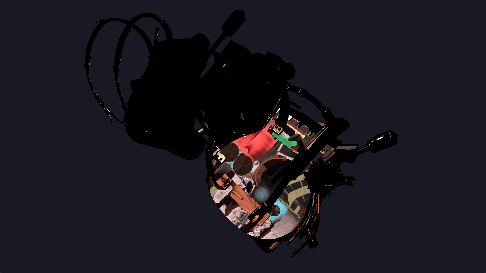
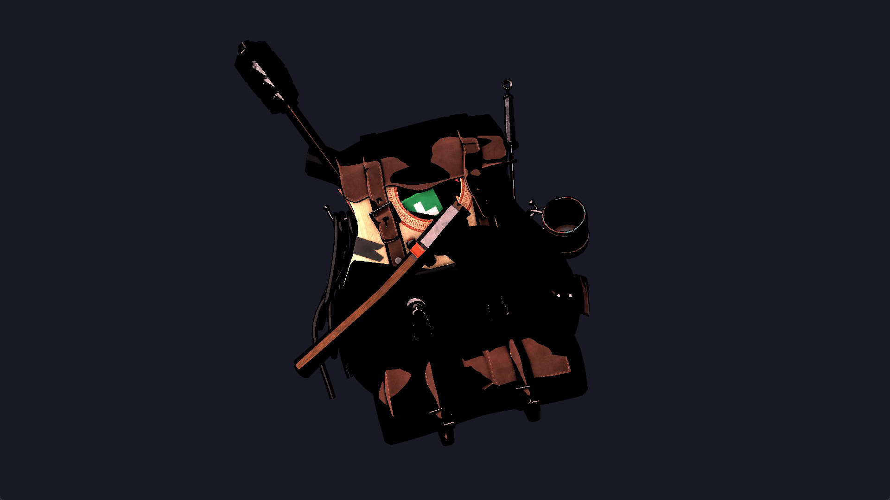

When I started building [Iris Engine](https://github.com/Riari/iris-engine) last year, I thought I had a pretty humble vision: I was going to build my first 3D game engine and it was almost certainly going to be awful, but I would develop it far enough to at least be able to create a game with it and learn a ton of stuff in the process. I should have seen it coming, but it didn't quite go to plan!

Modern game engines are immensely complex considering the requirements they typically must satisfy—especially those designed to be genre-agnostic and robust enough to be reasonably useful for any type of game. It should be no surprise that my very first attempt to build something even remotely approaching that category was doomed to fail (something that I sort of hinted at at the end of [part 2 of the devlog series](/posts/2021/04/3d-game-engine-devlog-part-2-scene-improvements/) without realising quite how right I was).

The last big feature I attempted to work on was model loading. I wanted to integrate [assimp](https://github.com/assimp/assimp) so I could load common 3D model formats and render them. That's when I started having issues. I should point out that they were no fault of assimp's—it was doing its part just fine, but somewhere along the way I was handling the resulting data incorrectly. While model files were being loaded without errors, they were being rendered with obvious texture and lighting issues:

I was able to correct the texture issues (which turned out to be a simple case of telling assimp not to flip UVs on import), but the lighting issues remained. I went back to it at several points to attempt various fixes, none of which worked. This wasn't helped by the sloppy architecture I had already established, which was compounded by the momentum of adding new features (especially as I had already started building up some long term plans).

In the year since I started that model loading work, I've revisited the code less and less frequently to the point that I was putting it aside for months at a time. I was still somewhat determined to fix it and get back on track, and to that end, I recently started ripping out the very primitive bitset ECS I wrote to replace it with an open source archetype ECS (namely [Flecs](https://github.com/SanderMertens/flecs)), the goal of which was twofold: it would possibly help me uncover the cause of the rendering issue as I migrated all of the logic into a new ECS, and it would eliminate a big chunk of first party code (one less thing to iterate on and maintain). Unfortunately, I didn't get far with that, and while I'm fairly confident that I _could_ get to the bottom of the issue and fix it, it became apparent that I was having an issue of motivation more than anything else.

More recently than that, I was watching some tech talks and stumbled across a few very good ones by Mike Acton (an engine programmer with over 20 years of industry experience, including 10 years as Engine Director at Insomniac Games). In several of his talks, such as [this one at TGC 2017](https://youtu.be/4B00hV3wmMY?t=757) (although I highly recommend watching them in full as they're very insightful), he mentions practice and what it actually means to practice something. While I certainly don't consider myself to be an engine programmer by profession (the target audience of that talk), that part sparked an epiphany in me: I was going about practice almost entirely in the wrong way.

To highlight some of Mike's key points and where I went wrong:

* The goal of practice is to explore gaps in knowledge and fill them. I was increasingly spending time resolving issues that got in the way of doing that.
* The nature of practice is ephemeral: a deep, long-term project is not an ideal base for it.
* Practice is not research. It's not about finding the best methods or solutions, nor is it about presenting them. It's about incrementally getting better at doing a specific thing.

While I'm not intent on reducing my approach to the scale Mike talked about (i.e. daily, 30-minute throwaway sessions), I'm definitely going to greatly reduce the scope of my explorations. I learned a lot from Iris Engine (a testament to which being that some of what I wrote both in the code and in the devlogs makes me cringe now!), but it's time to try something else. Something far less ambitious, but better for developing my skills. While I don't have specifics in mind yet, the first thing I want to do is try building a very small game (or even a non-interactive program) with an emphasis on OpenGL so I can get better at building OpenGL pipelines.

That probably means I won't be posting devlogs as such (at least until I'm working on a project where the end goal isn't about teaching myself), but I might occasionally write about interesting discoveries or things I'd like to show off.

For now, the Iris Engine repo is archived, and if you're one of the few people even looking at this: thanks for reading! Until next time. o/