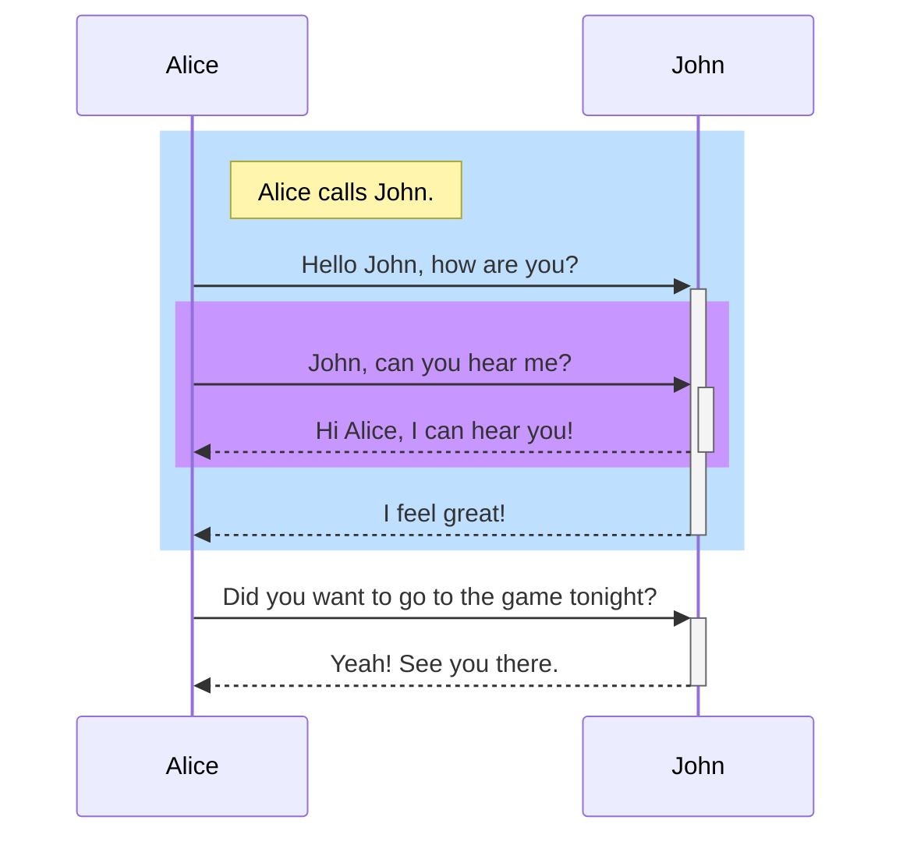

import ContentFooter from "../../components/ContentFooter.astro";
import Document from "../../components/Document.astro";
import Head from "../../components/Head.astro";

<Document title="Mermaid test" description="">
    <div class="container container--post">
        <Head title="Mermaid test">
            <h2 class="subheading">Test</h2>
        </Head>

        <div class="body">
            <div class="inner-container">
                <article>


````md title="Flowchart example using MermaidJS text"

````

```js {10, 12}
import { getCollection } from 'astro:content';

export async function loadAndFormatCollection(name) {
    const posts = await getCollection(name);

    posts.forEach(post => {
        const date = new Date(post.data.pubDate);
        const year = date.getFullYear();
        const month = date.getMonth() + 1;
        const monthZerofilled = (month < 10 ? '0' : '') + month;

        post.relativePath = `${year}/${monthZerofilled}/${post.slug}/`;
        post.absolutePath = `/posts/${post.relativePath}`;
    });

    return posts;
};
```

```bash
echo "This terminal frame has no title"
```

```powershell title="PowerShell terminal example"
Write-Output "This one has a title!"
```

                </article>
            </div>
        </div>

        <ContentFooter />
    </div>
</Document>